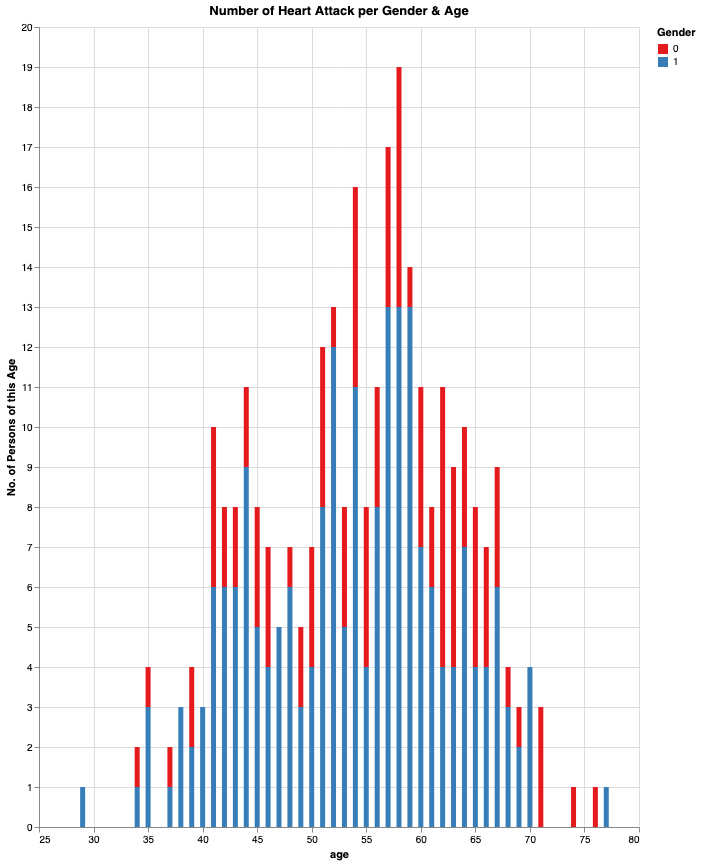
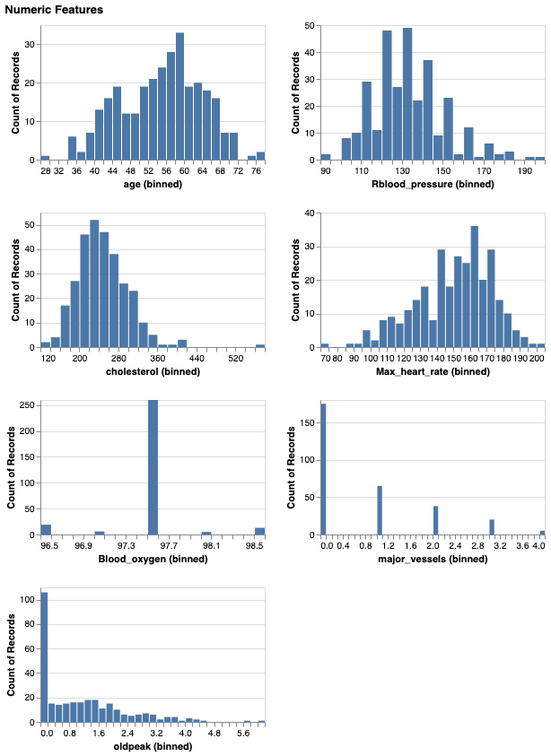
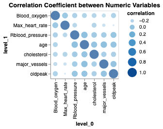
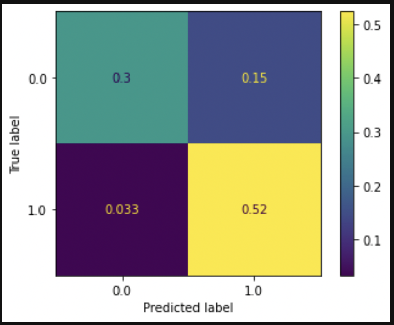

# Predicting Heart Attacks

According to the [Government of Canada](https://www.canada.ca/en/public-health/services/publications/diseases-conditions/heart-disease-canada.html):
- every hour, about 14 Canadian adults age 20 and over with diagnosed heart disease die.

This makes heart disease, and in this specific case, heart attacks an important issue with which to treat.

The present project works with a sample of real world publicly available health data pertaining to heart attacks in order to explore a predictive model for heart attacks. This model employs various health metrics.

## 1. An Exploratory Data Analysis (EDA)
An EDA is included that aims to provide an understanding of the dataset and what challenges or issues it may contain. This allows for the use of data visualizations to further describe the data and feature relationships within it.

## 2. A Random Forest Predictive Model
A random forest predictive model is used because it provides better accuracy (tradeoff) than other classifiers, which includes a lower risk of over-fitting. The data includes categorical features, which might result in a bias (tradeoff) of the random forest algorithm. This does not heavily disadvantage the exploratory intent of this project.

The aim of this model to predict the likelihood of a patient getting a heart attack. All features excepting the target feature (`Heart_attack`) are in play. This comprises:
- `age`
- `sex`
- `chest_pain`
- `Rblood_pressure`
- `cholesterol`
- `Fblood_sugar`
- `Rest_ECG`
- `Max_heart_rate`
- `exercize_angina`
- `oldpeak`
- `slope`
- `major_vessels`
- `TStress_result`
- `Blood_oxygen`

Some feature could be left out in a refined version of this predictive model such as slope. Further consultation is needed in order to determine the value, use, and relationship of this feature with the target feature.

## 3. Data Dictionary
A data dictionary is provided that explains each feature name.

| Attribute |  Description | 
|----------|:-------------:|
| age |  Age of the patient |
| sex |    Sex of the patient   |
| cp | Chest pain type ~ 0 = Typical Angina, 1 = Atypical Angina, 2 = Non-anginal Pain, 3 = Asymptomatic |
| trtbps | Resting blood pressure (in mm Hg) |
|chol | Cholestoral in mg/dl fetched via BMI sensor |
|fbs | (fasting blood sugar > 120 mg/dl) ~ 1 = True, 0 = False |
|restecg | Resting electrocardiographic results ~ 0 = Normal, 1 = ST-T wave normality, 2 = Left ventricular hypertrophy |
|thalachh | Maximum heart rate achieved |
|oldpeak | Previous peak|
| slp | Slope|
| caa | Number of major vessels|
| thall | Thalium Stress Test result ~ (0,3) |
| exng | Exercise induced angina ~ 1 = Yes, 0 = No |
| o2Saturation | Blood oxygen saturation (%) |
| output | Target variable|

## Visualizations

### Interactive Tooltip Barchart - interaction enabled when code is ran

### Numeric Features Plot

### Correlation Plot

### Confusion Matrix

## Production

This model can be placed into production via autmation, using sklearn for example. At present, the model can be run by runningy the .py or .ipynb files included here.

